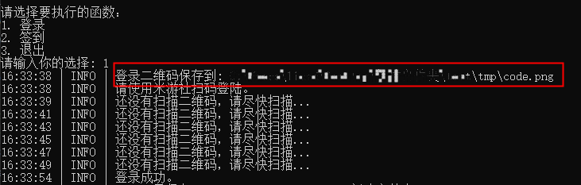
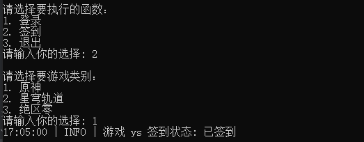

<div align="center">
  <a href="https://github.com/BuCaicai/mys-qd" target="_blank">
    
  </a>
  <h1 id="koishi">mys-qd</h1>


</div>

米游社 原神 星穹轨道 绝区零 游戏签到 个人学习使用！

## 预览

## 说明

Python >= 3.9

## 安装

1、下载最新的release文件 (mys_qd.zip) [下载链接](https://github.com/BuCaicai/mys-qd/releases)

2、解压 & 运行

```shell
unzip /path/mys-qd-v0.1.zip
cd /path/mys-qd
双击 main.exe
```

3、登录

- ⚠ 二维码请在1分钟内扫描！！



4、签到

- 选择游戏进行签到



### 注意

* 配置文件`config.cfg`非必要不用需改，程序运行时会自动获取并覆盖
* 日志、登录二维码、`cookie`都在`tmp`目录下

## 项目问题

反馈程序BUG或提供建议: [点此链接](https://github.com/BuCaicai/mys-qd/discussions/new/choose)

## 免责声明

详见[MIT License](./LICENSE)，切勿进行盈利，所造成的后果与本人无关。

## 捐赠

如果你想支持这个项目的话 [爱发电](https://afdian.com/a/BuCaicai)